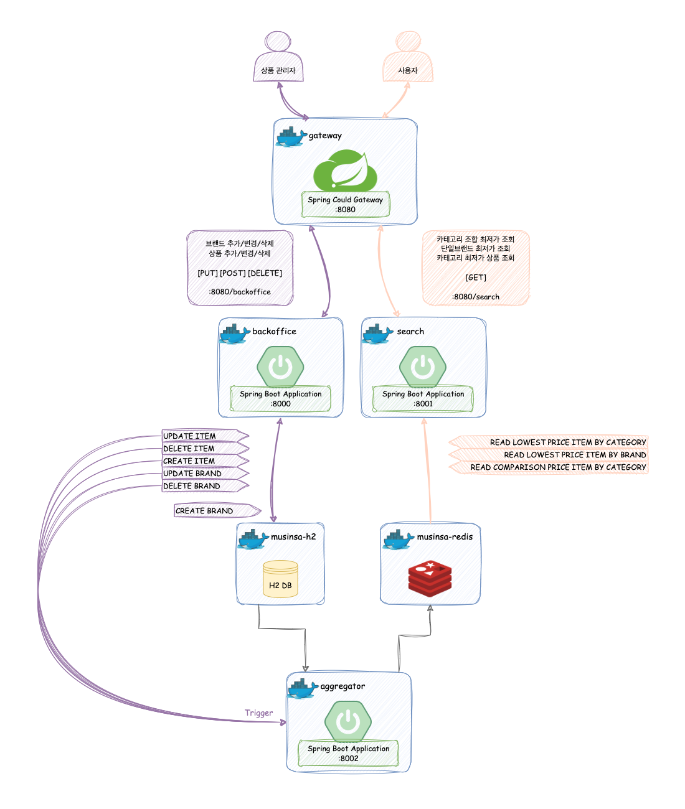
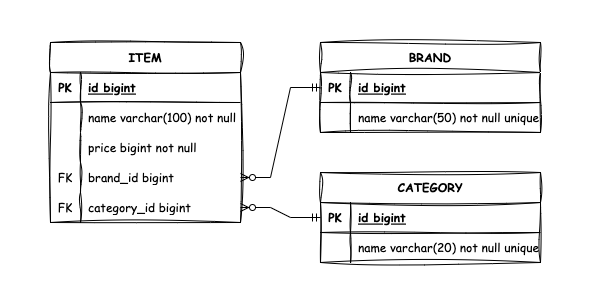
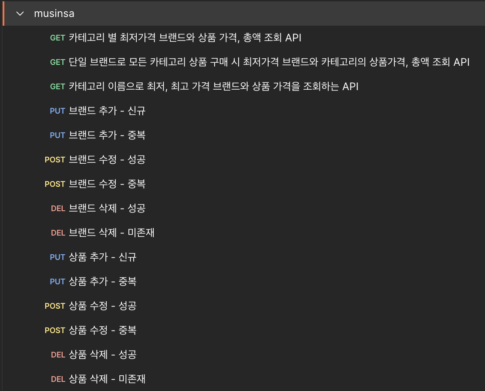
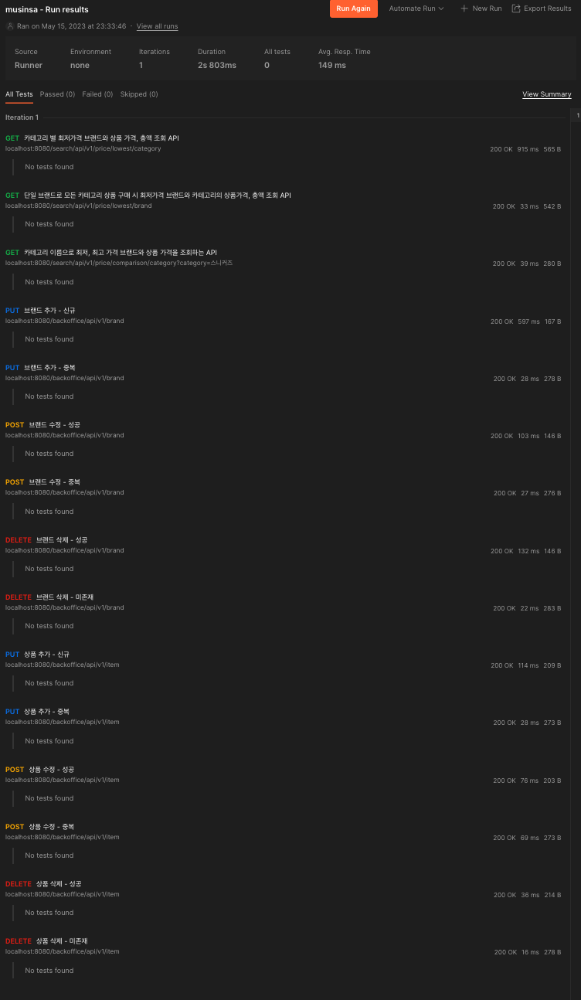

# Musinsa Assignment

## 목차

- [서비스 구조 및 아키텍처와 ERD](#서비스-구조-및-아키텍처와-erd)
- [주어진 조건 외 사용한 스택 및 라이브러리](#주어진-조건-외-사용한-스택-및-라이브러리)
- [요구사항 구현](#요구사항-구현)
- [실행법](#실행법)
- [postman으로 실행해보기](#postman으로-실행해보기)
- [개선 포인트](#개선-포인트)
---

## 서비스 구조 및 아키텍처와 ERD
- [gateway](./gateway)
  - backoffice와 search 서비스의 게이트웨이 역할
  - 8080 포트로 모든 요청을 받음
- [backoffice](./backoffice)
  - 상품 및 브랜드의 추가/수정/삭제 서비스
- [search](./search/README.md)
  - 사용자에게 필요한 데이터 검색 서비스
    - 카테고리 조합 최저가 조회
    - 단일 브랜드 최저가 조회
    - 카테고리 최저가 상품 조회
- [aggregator](./aggregator)
  - backoffice 데이터 집계하여 search 서비스에 사용할 수 있도록 ETL 수행 역할

### 아키텍처

  
### ERD
  

--- 

## 주어진 조건 외 사용한 스택 및 라이브러리
- Spring Cloud Gateway
  - backoffice 성격의 서비스와 사용자 서비스의 컨테이너 분리 및 동일한 포트의 요청 수신을 위해 도입
- Redis
  - backoffice에서 수정되는 H2 DB와 별개로, 사용자의 조회용 데이터를 따로 저장해두기 위한 용도로 도입
  - 요구사항에 명시된 데이터를 조회하기 위해서 H2 DB의 집계된 데이터가 필요함
    - 해당 집계 데이터는 상품 데이터의 변경이 없는 한 멱등성이 지켜지는 데이터이므로 미리 집계해두어 Redis에 저장
    - 만약 backoffice를 통해 상품데이터가 변경되면, aggregator에 의해 집계 데이터 갱신 API 호출하여 새로운 집계 데이터 저장
- Open Feign
  - backoffice에서 상품데이터가 변경되면 aggregator API 호출하기 위해 사용한 원격 API 호출 라이브러리

---

## 요구사항 구현
- [search 기능](./search/README.md#기능-구현)
  - 고객은 카테고리 별로 최저가격인 브랜드와 가격을 조회하고 총액이 얼마인지 확인할 수 있어야 합니다.
  - 고객은 단일 브랜드로 전체 카테고리 상품을 구매할 경우 최저가격인 브랜드와 총액이 얼마인지 확인할 수 있어야 합니다.
  - 고객은 특정 카테고리에서 최저가격 브랜드와 최고가격 브랜드를 확인하고 각 브랜드 상품의 가격을 확인할 수 있어야 합니다.
  
- [backoffice 기능](./backoffice/README.md#기능-구현)  
  - 운영자는 새로운 브랜드를 등록하고, 모든 브랜드의 상품을 추가, 변경, 삭제할 수 있어야 합니다.

---

## 실행법
### docker-compose 이용
- h2, redis, backoffice, search, aggregator, gateway 컨테이너를 컴포징 하여 실행하는 방법입니다.

```cmd
# docker-compose.yml과 docker-build 스크립트가 위치한 경로로 이동 후 아래 과정을 실행합니다.

# windows
> .\docker-build.bat

# etc
$ ./docker-build.sh


...
[+] Running 7/7
 ⠿ Network musinsa_default  Created    0.0s
 ⠿ Container musinsa-h2     Started    0.6s
 ⠿ Container musinsa-redis  Started    0.8s
 ⠿ Container backoffice     Started    1.0s
 ⠿ Container aggregator     Started    1.2s
 ⠿ Container search         Started    1.5s
 ⠿ Container gateway        Started    1.9s


$ docker ps
CONTAINER ID   IMAGE                    COMMAND                  CREATED         STATUS         PORTS                    NAMES
9ecc4eb194b8   musinsa/gateway:1.0      "java -jar -Dspring.…"   3 minutes ago   Up 3 minutes   0.0.0.0:8080->8080/tcp   gateway
a3418a1d6a40   musinsa/search:1.0       "java -jar -Dspring.…"   3 minutes ago   Up 3 minutes   8001/tcp                 search
5fbeb0a919a8   musinsa/aggregator:1.0   "java -jar -Dspring.…"   3 minutes ago   Up 3 minutes   8002/tcp                 aggregator
6e226b3451ad   musinsa/backoffice:1.0   "java -jar -Dspring.…"   3 minutes ago   Up 3 minutes   8000/tcp                 backoffice
9195318731ff   redis:7.0.4              "docker-entrypoint.s…"   3 minutes ago   Up 3 minutes   6379/tcp                 musinsa-redis
c747cad23ea4   oscarfonts/h2:2.1.210    "/bin/sh -c 'java -c…"   3 minutes ago   Up 3 minutes   81/tcp, 1521/tcp         musinsa-h2


# 중지
docker-compose down
```

---

## postman으로 실행해보기
[postman 컬렉션](./musinsa.postman_collection.json) import 하여 순차적으로 실행해보며 결과를 확인할 수 있습니다.




---

## 개선 포인트
- backoffice에서 대량 상품 정보 변경 수행에 대한 고민
  - 현재는 단일 상품, 단일 브랜드에 대한 기능 뿐이지만, 대량의 상품 가격 일괄 변경과 같은 기능이 없습니다.
- aggregator 작동 방식에 대한 고민
  - 매번 전체 집계를 수행하여 효율이 좋지 않습니다.
  - 증분 데이터, 변경 데이터에 대한 명확한 감지가 가능하다면 집계 로직을 간소화 할 수 있습니다.
    - Kafka CDC Connector를 지원하는 RDB를 사용한다면 구현해볼 수 있습니다.
- redis에 대한 고민
  - 현재 요구사항에 의하면 사용자가 조회할 집계 데이터는 상품 정보가 변경되지 않는 한 멱등성이 보장되는 데이터입니다.
  - 추후 조회할 데이터들의 종류가 많아지고, 그 안에서 특정 조건으로 검색을 해야 할 상황이라면 redis는 그다지 좋은 선택지는 아니라고 생각합니다.
  - 다중 조건 검색에 유리한 Elasticsearch를 도입하면 다양한 요구사항에 맞는 집계 검색 또는 조건 검색을 수행할 수 있습니다.
  - 이 때, 현재 aggregator와 비슷한 작동을 하는 색인기가 필요하고 정확한 변경사항을 반영하여 색인을 하기 위해서는 중간에 메세지 큐 등이 필요할 수 있습니다.
