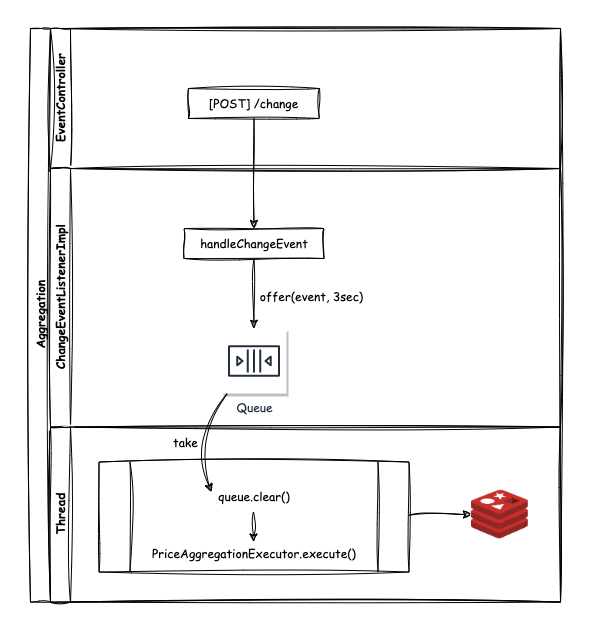

# Musinsa Aggregator
- 무신사 상품 데이터 집계 서비스입니다.
- 요구사항 1~3에 해당하는 데이터를 사전에 적재해둡니다.
- backoffice로부터 상품 데이터 추가/수정/삭제, 브랜드 데이터 수정/삭제 이벤트를 수신받아 집계 갱신을 수행합니다.

--- 

## 목차
- [프로젝트 설정](#프로젝트-설정)
- [작동 원리](#작동-원리)
- [주요 집계](#주요-집계)

---

## 프로젝트 설정
- 해당 프로젝트는 redis와 h2에 종속적입니다.
- 프로젝트의 설정에서 server.port=8002 이지만 사용자 요청과 무관한 통신 포트입니다.
  - 즉, 과제 요구사항의 포트 조건과 무관한 설정값입니다.
  - 해당 포트는 backoffice로부터 이벤트 수신 용도로 쓰입니다.

---

## 작동 원리

- aggregator의 특정 [endpoint](src/main/java/com/devh/project/musinsa/aggregator/controller/EventController.java#L18-L23)가 호출되면 이벤트가 발생했다고 판단하여 이벤트를 큐에 삽입합니다. [ChangeEventListenerImpl](src/main/java/com/devh/project/musinsa/aggregator/listener/ChangeEventListenerImpl.java#L34-L38)
  - 큐를 두는 이유
    - 호출된 요청 세션에게 집계 완료 후 응답을 내려주게 되면, 요청 쪽에서 오랜 시간을 기다려야 하거나 타임아웃이 발생할 수 있기 때문입니다.
  - 큐는 단순히 집계 데이터를 갱신해야 하는지 판단하기 위한 데이터가 담깁니다.
  - 큐의 데이터를 꺼내어 집계를 수행하는 로직은 별도 [Thread](src/main/java/com/devh/project/musinsa/aggregator/listener/ChangeEventListenerImpl.java#L22-L30)를 통해 수행합니다.
  - 집계를 수행하는 도중에 큐가 꽉차면, offer를 통해 3초 대기 후 건너 뜁니다.
    - 수행중인 집계가 끝난 후 큐에서 다음 데이터가 꺼내지면 다시 집계를 수행하고 큐를 초기화합니다.
    - 즉, 큐가 꽉 차있을 때 건너 뛰어도 새로운 집계 사이클이 누락되지 않습니다.
---

## 주요 집계
1. [카테고리별 최저가 상품 목록 및 총액](src/main/java/com/devh/project/musinsa/aggregator/executor/PriceAggregationExecutor.java#L47-L53)
    - [적재 쿼리](src/main/java/com/devh/project/musinsa/aggregator/domain/item/repository/ItemRepository.java#L70-L92)
2. [단일 브랜드 기준 최저가 브랜드 및 총액](src/main/java/com/devh/project/musinsa/aggregator/executor/PriceAggregationExecutor.java#L55-L82)
    - [적재 쿼리](../aggregator/src/main/java/com/devh/project/musinsa/aggregator/domain/item/repository/ItemRepository.java#L94-L109)
3. [특정 카테고리 최저가/최고가 브랜드](src/main/java/com/devh/project/musinsa/aggregator/executor/PriceAggregationExecutor.java#L84-L93)
    - [적재 쿼리](../aggregator/src/main/java/com/devh/project/musinsa/aggregator/domain/item/repository/ItemRepository.java#L15-L68)