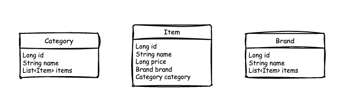

# Musinsa Backoffice
- 무신사 브랜드와 상품에 대한 추가/변경/삭제를 수행하는 서비스입니다.
- H2 DB의 브랜드와 상품 데이터에 관여합니다.

---

## 목차
- [프로젝트 설정](#프로젝트-설정)
- [엔티티 그래프](#엔티티-그래프)
- [aggregator 연동](#aggregator-연동)
- [기능 구현](#기능-구현)
- [단위 테스트](#단위-테스트)
- [API 검증 결과](#api-검증-결과)

--- 

## 프로젝트 설정
- 구동시 src/resources/data.sql에 의해 H2 DB에 요구사항에 주어진 데이터가 삽입됩니다.
  - 즉, 해당 프로젝트는 H2 DB에 종속적입니다.
  - H2 DB는 profile에 따라 in-memory를 사용하거나, local 또는 docker 컨테이너 통신을 설정할 수 있습니다.
    - -Dspring.profiles.active=local
      - local h2 db가 standalone으로 사용하는 경우
    - -Dspring.profiles.active=mem
      - in-memory h2 db를 사용하는 경우
    - -Dspring.profiles.active=docker
      - docker 컨테이너 실행 시 해당 profile로 작동
- 프로젝트의 설정에서 server.port=8000 이지만, gateway를 통해 사용자의 요청이 들어옵니다.
  - 즉, 과제 요구사항의 포트 조건과 무관한 설정값입니다.

--- 

## 엔티티 그래프


---

## aggregator 연동
- 구동시 별도 Thread를 통해 aggregator와 연결을 시도합니다.
  - 최초 연결 가능 시점에서 aggregator에게 집계 데이터 생성 요청을 합니다.
  - [ApplicationRunner 구현체](src/main/java/com/devh/project/musinsa/backoffice/runner/BackofficeRunner.java#L19-L31)
- 브랜드 수정/삭제, 상품 추가/수정/삭제시 aggregator에게 집계 데이터 재생성 요청을 합니다.
  - [상품 추가/수정/삭제 AOP OpenFeign 연동](src/main/java/com/devh/project/musinsa/backoffice/domain/item/aspect/ItemAspect.java#L53-L57)
  - [브랜드 추가/수정/삭제 AOP OpenFeign 연동](src/main/java/com/devh/project/musinsa/backoffice/domain/brand/aspect/BrandAspect.java#47-L49)

--- 

## 기능 구현
1. [브랜드 관련 기능 요청 수신 컨트롤러](src/main/java/com/devh/project/musinsa/backoffice/domain/brand/controller/BrandController.java)  
    - 중복 브랜드 판단 기준은 브랜드명의 유일성 입니다.
    - 요청 값에 대한 검증은 spring-validation을 통해 수행합니다.
    - 추가 요청은 HTTP PUT 메소드로 수신하고, 중복된 브랜드가 있으면 예외처리 했습니다.
    - 수정 요청은 HTTP POST 메소드로 수신하고, 수정할 브랜드명이 중복인 경우 예외처리 했습니다.
    - 삭제 요청은 HTTP DELETE 메소드로 수신하고, 삭제할 브랜드 ID 값이 존재하지 않는 경우 예외처리 했습니다.  
  
2. [상품 관련 기능 요청 수신 컨트롤러](src/main/java/com/devh/project/musinsa/backoffice/domain/item/controller/ItemController.java)  
    - 중복 상품 판단 기준은 (상품명 + 브랜드 + 카테고리) 조합의 유일성 입니다.
    - 요청 값에 대한 검증은 spring-validation을 통해 수행합니다.
    - 추가 요청은 HTTP PUT 메소드로 수신하고, 중복된 상품이 있으면 예외처리 했습니다.
    - 수정 요청은 HTTP POST 메소드로 수신하고, 수정된 상품이 중복인 경우 예외처리 했습니다.
    - 삭제 요청은 HTTP DELETE 메소드로 수신하고, 삭제할 상품 ID 값이 존재하지 않는 경우 예외처리 했습니다.
  
3. [공통 응답 객체](src/main/java/com/devh/project/musinsa/backoffice/domain/common/dto/ApiResponse.java)
4. [공통 에러 객체](src/main/java/com/devh/project/musinsa/backoffice/domain/common/dto/ErrorResponse.java)
    - [Brand AOP](src/main/java/com/devh/project/musinsa/backoffice/domain/brand/aspect/BrandAspect.java)
    - [Item AOP](src/main/java/com/devh/project/musinsa/backoffice/domain/item/aspect/ItemAspect.java)
    - [ControllerAdvice](src/main/java/com/devh/project/musinsa/backoffice/domain/common/advice/ControllerAdvice.java)

---

## 단위 테스트
```bash
$ ./gradlew test
```

---

## API 검증 결과
### 브랜드 관련 API
```
[1. 브랜드 추가]
Request: 
    [PUT] localhost:8080/backoffice/api/v1/brand
    Body:
        {
            "name": "새로운브랜드명"
        }
Response:
    {
        "data": [
            {
                "id": 10,
                "name": "새로운브랜드명"
            }
        ]
    }

[2. 중복 브랜드 추가]
Request:
    [POST] localhost:8080/backoffice/api/v1/brand
    Body:
        {
            "id": "1",
            "name": "B"
        }
Response:
    {
        "timestamp": "2023-05-15T14:33:48.1671735",
        "errorCode": "BRAND_DUPLICATE_ERROR",
        "exception": "BrandException",
        "message": "이미 존재하는 브랜드입니다."
    }

[3. 기존 브랜드 수정]
Request:
    [POST] localhost:8080/backoffice/api/v1/brand
    Body:
        {
            "id": "1",
            "name": "Z"
        }
Response:
    {
        "data": [
            {
                "id": 1,
                "name": "Z"
            }
        ]
    }

[4. 기존 브랜드 수정시 중복 발생]
Request:
    [POST] localhost:8080/backoffice/api/v1/brand
    Body:
        {
            "id": "1",
            "name": "B"
        }
Response:
    {
        "timestamp": "2023-05-15T14:33:48.1671735",
        "errorCode": "BRAND_DUPLICATE_ERROR",
        "exception": "BrandException",
        "message": "이미 존재하는 브랜드입니다."
    }

[5. 기존 브랜드 삭제]
Request:
    [DELETE] localhost:8080/backoffice/api/v1/brand
    Body:
        {
            "id": "1"
        }
Response:
    {
        "data": [
            {
                "id": 1,
                "name": "A"
            }
        ]
    }


[6. 존재하지 않는 브랜드 삭제]
Request:
    [DELETE] localhost:8080/backoffice/api/v1/brand
    Body:
        {
            "id": "999"
        }
Response:
    {
        "timestamp": "2023-05-15T14:33:48.357531167",
        "errorCode": "BRAND_NOT_FOUND_ERROR",
        "exception": "BrandException",
        "message": "대상 브랜드를 찾을 수 없습니다."
    }
```

### 상품 관련 API
```
[1. 신규 상품 추가]
Request:
    [PUT] localhost:8080/backoffice/api/v1/item
    Body:
        {
            "itemName": "새로운상품명",
            "categoryName": "바지",
            "brandName": "B",
            "price": 5400
        }
Response:
    {
        "data": [
            {
                "id": 73,
                "name": "새로운상품명",
                "category": "바지",
                "brand": "B",
                "price": 5400
            }
        ]
    }

[2. 중복 상품 추가]
Request:
    [PUT] localhost:8080/backoffice/api/v1/item
    Body:
        {
            "itemName": "D의 상의",
            "categoryName": "상의",
            "brandName": "D",
            "price": 3400
        }
Response:
    {
        "timestamp": "2023-05-15T14:33:48.525885458",
        "errorCode": "ITEM_DUPLICATE_ERROR",
        "exception": "ItemException",
        "message": "이미 존재하는 상품입니다."
    }

[3. 기존 상품 수정]
Request:
    [POST] localhost:8080/backoffice/api/v1/item
    Body:
        {
            "id": 20,
            "itemName": "변경상의",
            "brandName": "H",
            "categoryName": "상의"
        }
Response:
    {
        "data": [
            {
                "id": 20,
                "name": "변경상의",
                "category": "상의",
                "brand": "H",
                "price": 3800
            }
        ]
    }

[4. 기존 상품 수정시 중복 발생]
Request:
    [POST] localhost:8080/backoffice/api/v1/item
    Body:
        {
            "id": 33,
            "itemName": "B의 상의",
            "brandName": "B",
            "categoryName": "상의"
        }
Response:
    {
        "timestamp": "2023-05-15T14:33:48.693017458",
        "errorCode": "ITEM_DUPLICATE_ERROR",
        "exception": "ItemException",
        "message": "이미 존재하는 상품입니다."
    }

[5. 기존 상품 삭제]
Request:
    [DELETE] localhost:8080/backoffice/api/v1/item
    Body:
        {
            "id": "30"
        }
Response:
    {
        "data": [
            {
                "id": 30,
                "name": "C의 스니커즈",
                "category": "스니커즈",
                "brand": "C",
                "price": 9200
            }
        ]
    }

[6. 존재하지 않는 상품 삭제]
Request:
    [DELETE] localhost:8080/backoffice/api/v1/item
    Body:
        {
            "id": "999"
        }
Response:
    {
        "timestamp": "2023-05-15T14:33:48.771641792",
        "errorCode": "ITEM_NOT_FOUND_ERROR",
        "exception": "ItemException",
        "message": "대상 상품을 찾을 수 없습니다."
    }
```