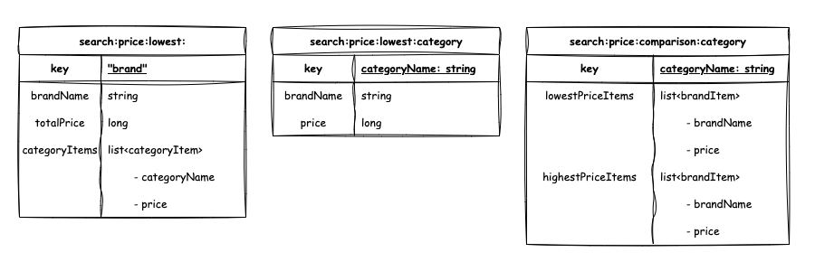

# Musinsa Search
- 무신사 가격 관련 검색을 수행하는 서비스입니다.
- Redis에 집계된 데이터를 서빙합니다.
  - Redis 데이터 적재 집계는 [aggregator](../aggregator/README.md)에 의해 수행됩니다.

--- 

## 목차
- [프로젝트 설정](#프로젝트-설정)
- [엔티티 그래프](#엔티티-그래프)
- [기능 구현](#기능-구현)
- [단위 테스트](#단위-테스트)
- [API 검증 결과](#api-검증-결과)

---

## 프로젝트 설정
- 해당 프로젝트는 redis에 종속적입니다.
  - profile에 따라 local의 redis를 사용하거나 docker 컨테이너 통신을 설정할 수 있습니다.
    - -Dspring.profiles.active=local
    - -Dspring.profiles.active=docker
- 프로젝트의 설정에서 server.port=8001 이지만, gateway를 통해 사용자의 요청이 들어옵니다.
  - 즉, 과제 요구사항의 포트 조건과 무관한 설정값입니다.

--- 

## 엔티티 그래프


---

## 기능 구현
1. [카테고리별 최저가 상품 목록 및 총액 조회](src/main/java/com/devh/project/musinsa/search/domain/price/lowest/controller/LowestPriceController.java#L24-L27)
    - aggregator에 의해 redis에 적재된 캐시 데이터를 조회
    - [aggregator 적재 쿼리](../aggregator/src/main/java/com/devh/project/musinsa/aggregator/domain/item/repository/ItemRepository.java#L70-L92)
2. [단일 브랜드 기준 최저가 브랜드 및 총액 조회](src/main/java/com/devh/project/musinsa/search/domain/price/lowest/controller/LowestPriceController.java#L29-L32)
    - aggregator에 의해 redis에 적재된 캐시 데이터 조회
    - [aggregator 적재 쿼리](../aggregator/src/main/java/com/devh/project/musinsa/aggregator/domain/item/repository/ItemRepository.java#L94-L109)
3. [특정 카테고리 최저가/최고가 브랜드 조회](src/main/java/com/devh/project/musinsa/search/domain/price/comparison/controller/ComparisonPriceController.java#L19)
    - aggregator에 의해 redis에 적재된 캐시 데이터 조회
    - [aggregator 적재 쿼리](../aggregator/src/main/java/com/devh/project/musinsa/aggregator/domain/item/repository/ItemRepository.java#L15-L68)

---

## 단위 테스트
```bash
$ ./gradlew test
```

---

## API 검증 결과
### 카테고리 별 최저가격 브랜드와 상품 가격, 총액 조회 API
```
Request:
    [GET] localhost:8080/search/api/v1/price/lowest/category
Response:
    {
        "items": [
            {
                "category": "액세서리",
                "brand": "F",
                "price": "1,900"
            },
            {
                "category": "스니커즈",
                "brand": "A",
                "price": "9,000"
            },
            {
                "category": "상의",
                "brand": "C",
                "price": "10,000"
            },
            {
                "category": "바지",
                "brand": "D",
                "price": "3,000"
            },
            {
                "category": "모자",
                "brand": "D",
                "price": "1,500"
            },
            {
                "category": "양말",
                "brand": "I",
                "price": "1,700"
            },
            {
                "category": "아우터",
                "brand": "E",
                "price": "5,000"
            },
            {
                "category": "가방",
                "brand": "A",
                "price": "2,000"
            }
        ],
        "totalPrice": "34,100"
    }
```
    
### 단일 브랜드로 모든 카테고리 상품 구매 시 최저가격 브랜드와 카테고리의 상품가격, 총액 조회 API
```
Request:
    [GET] localhost:8080/search/api/v1/price/lowest/brand
Response:
    {
        "최저가": {
            "브랜드": "D",
            "카테고리": [
                {
                    "카테고리": "상의",
                    "가격": "10,100"
                },
                {
                    "카테고리": "아우터",
                    "가격": "5,100"
                },
                {
                    "카테고리": "바지",
                    "가격": "3,000"
                },
                {
                    "카테고리": "스니커즈",
                    "가격": "9,500"
                },
                {
                    "카테고리": "가방",
                    "가격": "2,500"
                },
                {
                    "카테고리": "모자",
                    "가격": "1,500"
                },
                {
                    "카테고리": "양말",
                    "가격": "2,400"
                },
                {
                    "카테고리": "액세서리",
                    "가격": "2,000"
                }
            ],
            "총액": "36,100"
        }
    }
```
    
### 카테고리 이름으로 최저, 최고 가격 브랜드와 상품 가격을 조회하는 API
```
Request:
    [GET] localhost:8080/search/api/v1/price/comparison/category?category=스니커즈
Response:
    {
        "카테고리": "스니커즈",
        "최저가": [
            {
                "브랜드": "A",
                "가격": "9,000"
            },
            {
                "브랜드": "G",
                "가격": "9,000"
            }
        ],
        "최고가": [
            {
                "브랜드": "E",
                "가격": "9,900"
            }
        ]
    }
```